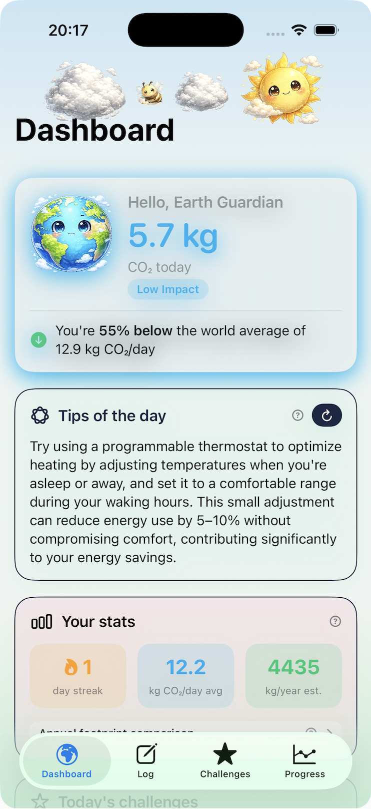
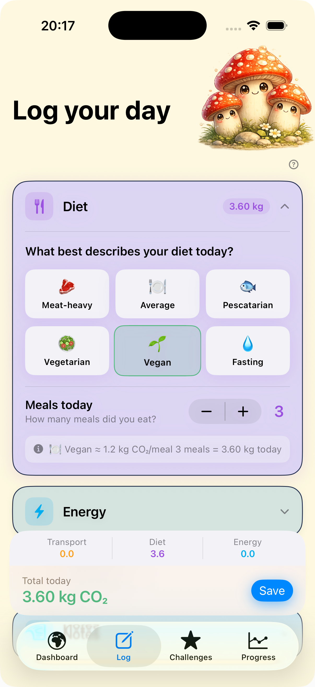
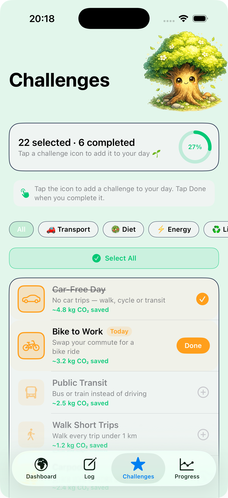

# 🌱 EcoCoach – Your Personal Carbon Footprint Tracker

EcoCoach is an iOS app built with SwiftUI that helps you understand, track, and reduce your personal CO₂ emissions. By logging daily activities across transport, diet, and energy use, you get a clear picture of your carbon footprint, receive personalised tips, and can take on challenges to lower your impact. The app combines a playful, friendly design with robust data tracking and optional on‑device AI for tailored advice (iOS 26+).

  
*Dashboard: at‑a‑glance footprint, animated Earth status, and a personalised tip.*

---

## ✨ Features

- **Dashboard** – View today’s total CO₂, your impact level (Amazing! / Great! / Low Impact / Impacting / High Impact), and a comparison to world, EU, and US averages. An animated Earth character changes expression based on your performance.
- **Daily Logging** – Detailed input for:
  - **Transport** – Car, moto, bus, train, taxi, plane with distance in miles/km and a fuel/electric toggle.
  - **Diet** – Choose from six dietary patterns (Meat‑heavy to Fasting) and specify number of meals.
  - **Energy** – Enter electricity usage in kWh, with quick‑reference chips for common appliances.
  - **Notes** – Add context (e.g., “WFH day”, “long flight”).
- **Personalised Tips** – The app analyses your last 7 days to identify your biggest emission source and delivers an evidence‑based tip. On iOS 26+ this is powered by Apple’s Foundation Models (on‑device AI); on earlier versions a curated library of 36 tips is used.
- **Challenges** – Choose from 24 challenges across transport, diet, energy, and lifestyle. Mark them as done, see your progress, and estimate the CO₂ saved. A circular progress indicator shows your daily completion rate.
- **Progress Charts** – Interactive charts show your total CO₂ over time (bar chart), a breakdown by category (line chart), and a calendar view to review or edit past entries.
- **Streak & Statistics** – Track your logging streak, average daily footprint, and projected annual emissions, all compared to global benchmarks.



*Logging screen with collapsible sections and live total.*

  
*Challenges: select, complete, and track your impact.*

---

## 🧱 Architecture & Design Choices

EcoCoach follows an **MVVM** pattern with SwiftUI. The main components are:

- **`DataStore`** – An `ObservableObject` that manages all app data. It uses `@AppStorage` (UserDefaults) for persistence, so entries and challenges survive app restarts. Cached values (daily totals, streak, etc.) are recomputed on data changes and published via `objectWillChange`.
- **`AIAdvisor`** – Another `ObservableObject` that encapsulates tip generation. It checks for the presence of `FoundationModels` and falls back to a rotating library of 36 hand‑crafted tips. This ensures the app works on all iOS versions while being ready for future AI enhancements.
- **Models** – `DailyEntry`, `Challenge`, `CO2Benchmark`, `CategoryPoint` and `ImpactLevel` define the core data structures. They are `Codable` for easy persistence.
- **`FootprintCalculator`** – A static struct with emission factors based on widely cited sources (Our World in Data, IEA). It handles unit conversion (miles/kilometres) and electric/fuel options.
- **Views** – `HomeView`, `InputView`, `ChallengesView`, `ProgressTabView` (renamed to avoid conflict with SwiftUI’s `ProgressView`). Each uses `@EnvironmentObject` to access the shared `DataStore`.

### Key Design Decisions

- **Pastel Colour Palette** – Chosen to create a calm, approachable feel, encouraging regular use. Each category (transport, diet, energy) has its own accent colour for visual consistency.
- **Animated Earth Icons** – The dashboard shows a friendly Earth character that changes expression based on your impact level. Subtle animations (clouds, bees, sun) make the app feel alive.
- **Challenges System** – Inspired by habit‑building apps, challenges provide actionable steps with estimated CO₂ savings. Users can select challenges for the day and mark them done, reinforcing positive behaviour.
- **Streak Logic** – The streak counts consecutive days with at least one log entry, but if today has no entry but yesterday does, the streak starts from yesterday – a user‑friendly interpretation.
- **Fallback AI** – By conditionally compiling `FoundationModels`, the app is future‑proof. The fallback tips are stored in arrays and selected based on the user’s top category, avoiding repetition by tracking the last used index.
- **Input Section Expansion** – The log screen uses collapsible sections to reduce clutter; each section shows a live total, giving immediate feedback.

---

## 📁 File Structure

The project consists of the following Swift files (all included in the root of the repository):

| File | Purpose |
|------|---------|
| `EcoCoachApp.swift` | App entry point with `ContentView` as the root tab view. |
| `ColorExtensions.swift` | Custom colour definitions and hex initialiser. |
| `Models.swift` | All data models (`DailyEntry`, `Challenge`, `CO2Benchmark`, `CategoryPoint`, `ImpactLevel`). |
| `FootprintCalculator.swift` | Emission factors and calculation methods. |
| `AIAdvisor.swift` | Tip generation logic with iOS 26+ AI support. |
| `DataStore.swift` | Central data manager, persistence, and cached values. |
| `HomeView.swift` | Dashboard with hero card, stats, tips, challenges preview. |
| `InputView.swift` | Detailed logging form for transport, diet, energy, notes. |
| `ChallengesView.swift` | List of all challenges with filtering, selection, and completion. |
| `ProgressTabView.swift` | Charts (bar and line) and calendar view of past entries. |
| `TooltipButton.swift` (optional) | Reusable info button with sheet (included in `HomeView`). |
| `AnimatedObject.swift` (in `HomeView`) | Simple animated image component. |

---

## 🚀 Getting Started

1. **Clone the repository**  
   ```bash
   git clone https://github.com/yourusername/EcoCoach.git
