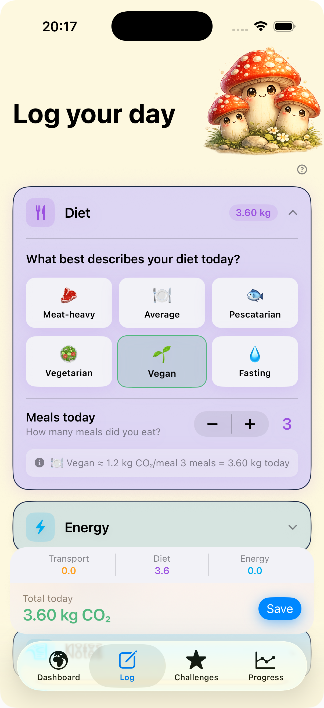
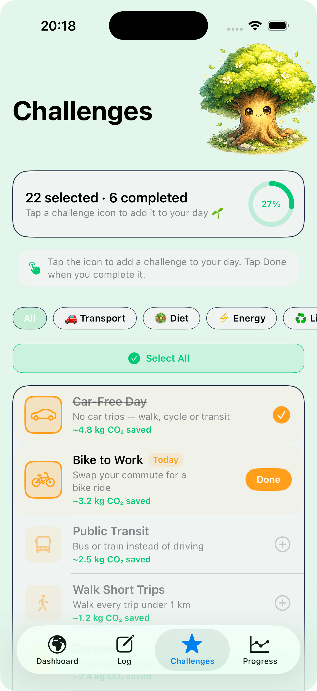

# 🌱 Carbon Tracker

> **An iOS app that helps you understand, track, and reduce your personal carbon footprint through daily activity logging, personalised tips, and habit-building challenges.**

#### CS50x Final Project · Video Demo: [https://youtu.be/cOHE5TMWkMo](https://youtu.be/cOHE5TMWkMo)

---

## 📌 Problem Statement

Most people have a vague sense that their lifestyle has a carbon cost, but no easy way to quantify it. Generic statistics about "average emissions" don't drive behaviour change — personal, contextual feedback does. Existing carbon tracking tools are either too complex, too abstract, or buried inside broader sustainability platforms. Carbon Tracker puts the data in your pocket: log what you actually did today, see your footprint in real time, and get one concrete tip to improve it tomorrow.

---

## 🧩 Project Overview

Carbon Tracker is an iOS app built with SwiftUI as the final project for [CS50x](https://cs50.harvard.edu/x/). It lets users log daily activities across three categories — transport, diet, and energy — and instantly calculates their CO₂ emissions using evidence-based factors from Our World in Data and the IEA. A personalised tip is generated each day based on the user's biggest emission source. On iOS 26+, this uses Apple's on-device Foundation Models; on earlier versions, a curated library of 36 tips provides a seamless fallback. Users can also take on 24 habit-building challenges and track their progress over time through interactive charts and a streak system.

<div align="center">

</div>

*Dashboard: at-a-glance footprint, animated Earth status, and a personalised tip.*

---

## 🛠️ Tech Stack

### 🌐 Languages
- Swift 5

### 📦 Frameworks & Libraries
- SwiftUI — Declarative UI framework
- Apple Foundation Models (`FoundationModels`) — On-device AI for tip generation (iOS 26+)
- Swift Charts — Interactive bar and line charts

### 🗄️ Databases & Storage
- `@AppStorage` / UserDefaults — On-device persistence for entries and challenges

### ☁️ Infrastructure & DevOps
- Xcode — Build and run
- iOS 17+ target (iOS 26+ for AI tips)

### 🔧 Tools & Other
- `Codable` — Model serialisation for UserDefaults persistence
- MVVM architecture pattern

---

## ✨ Features

- **Dashboard** — View today's total CO₂, your impact level (Amazing! / Great! / Low Impact / Impacting / High Impact), and a comparison to world, EU, and US averages. An animated Earth character changes expression based on your performance.
- **Daily Logging** — Detailed input for transport (car, moto, bus, train, taxi, plane), diet (six dietary patterns from meat-heavy to fasting), and energy (kWh with quick-reference appliance chips), plus freeform notes.
- **Personalised Tips** — Analyses your last 7 days to identify your biggest emission source and delivers an evidence-based tip. Powered by Apple Foundation Models on iOS 26+; a curated library of 36 tips on earlier versions.
- **Challenges** — 24 challenges across transport, diet, energy, and lifestyle. Mark them done, track daily progress via a circular indicator, and see estimated CO₂ saved.
- **Progress Charts** — Interactive bar chart (total CO₂ over time), line chart (breakdown by category), and a calendar view to review or edit past entries.
- **Streak & Statistics** — Logging streak, average daily footprint, and projected annual emissions, all benchmarked against global averages.

<div align="center">

</div>

*Logging screen with collapsible sections and live total.*

<div align="center">

</div>

*Challenges: select, complete, and track your impact.*

---

## 🏗️ Architecture & Technical Details

### System Design

Carbon Tracker follows an **MVVM** pattern with SwiftUI. A single shared `DataStore` object holds all state and is injected into views via `@EnvironmentObject`, keeping the UI layer thin and reactive.

### Data Flow

User input (transport distance, diet pattern, kWh) → `FootprintCalculator` applies emission factors → CO₂ totals published by `DataStore` → views re-render automatically. `AIAdvisor` reads the last 7 days from `DataStore`, identifies the top category, and returns a tip either from `FoundationModels` or the fallback library.

### Key Technical Decisions

- **`@AppStorage` over CoreData**: For a single-user log of lightweight `Codable` structs, UserDefaults is sufficient and keeps the data layer trivially simple — no migrations, no schemas.
- **Conditional `FoundationModels` compilation**: The AI tip path is gated behind an availability check so the app degrades gracefully on iOS < 26 without any user-facing difference.
- **Collapsible log sections with live totals**: Each category section in `InputView` shows a running subtotal as the user types, providing immediate feedback and reducing cognitive load.
- **Streak tolerance**: If today has no entry but yesterday does, the streak counts from yesterday — a deliberate UX choice to avoid punishing users for opening the app in the morning before logging.
- **Pastel palette**: Calm colours were chosen intentionally to make a topic (climate anxiety) feel approachable rather than alarming, encouraging daily engagement.

### Data Models

```
DailyEntry
  ├── id: UUID
  ├── date: Date
  ├── transportCO2: Double
  ├── dietCO2: Double
  ├── energyCO2: Double
  └── notes: String

Challenge
  ├── id: UUID
  ├── title: String
  ├── category: Category
  ├── estimatedSaving: Double
  └── isCompleted: Bool
```

---

## 📁 Project Structure

```
CarbonTracker/
├── CarbonTrackerApp.swift      # App entry point, root tab view
├── Models.swift                # DailyEntry, Challenge, CO2Benchmark, ImpactLevel
├── FootprintCalculator.swift   # Emission factors and CO₂ calculation logic
├── DataStore.swift             # ObservableObject — persistence and cached values
├── AIAdvisor.swift             # Tip generation (Foundation Models + fallback)
├── ColorExtensions.swift       # Custom colours and hex initialiser
├── HomeView.swift              # Dashboard — hero card, stats, tips, challenges preview
├── InputView.swift             # Logging form — transport, diet, energy, notes
├── ChallengesView.swift        # Challenge list with filtering, selection, completion
├── ProgressTabView.swift       # Charts (bar, line) and calendar of past entries
├── TooltipButton.swift         # Reusable info button with sheet
├── AnimatedObject.swift        # Animated Earth character component
└── screenshots/                # App screenshots for README
```

---

## ⚙️ Getting Started

### Prerequisites

- macOS with Xcode 15+
- iOS 17+ device or simulator (iOS 26+ for on-device AI tips)

### Installation

```bash
# 1. Clone the repository
git clone https://github.com/audreyhda/CarbonTracker.git
cd CarbonTracker

# 2. Open in Xcode
open CarbonTracker.xcodeproj

# 3. Select a simulator or connected device and press Run (⌘R)
```

No API keys or external dependencies required — the app is fully self-contained.

---

## 🗺️ Roadmap

- [x] Transport, diet, and energy logging with CO₂ calculation
- [x] Dashboard with animated Earth and impact level
- [x] 24 challenges with progress tracking
- [x] Interactive charts (bar, line, calendar)
- [x] Streak and statistics with global benchmarks
- [x] On-device AI tips via Apple Foundation Models (iOS 26+)
- [ ] iCloud sync for multi-device support
- [ ] Widget for quick daily logging from the home screen
- [ ] Share card to post your weekly footprint

---

## 📄 License

This project is licensed under the MIT License — see the [LICENSE](LICENSE) file for details.

---

## 👤 Author

**Audrey**
- GitHub: [@audreyhda](https://github.com/audreyhda)

---

*CS50x Final Project · Built with ❤️ and SwiftUI*
